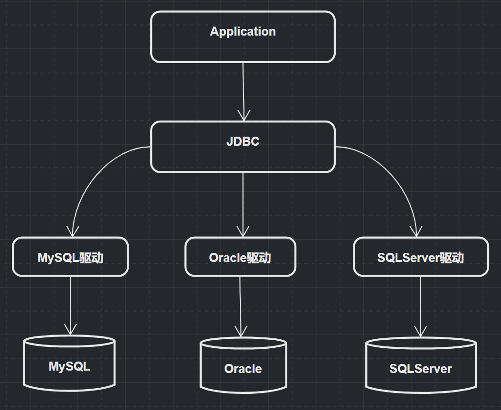

# JDBC
> JDBC（Java Data Base Connectivity,JAVA数据库连接）  
> J2EE的标准，定义了执行SQL语句的Java API  
> 各个数据库厂商(Mysql，Oracle...)根据标准提供了对应的实现/驱动，使得开发人员能够以此编写执行SQL的程序



## JDBC流程

### 加载驱动

Driver接口由数据库厂家提供，作为java开发人员，只需要使用Driver接口就可以了。  
在编程中要连接数据库，必须先装载特定厂商的数据库驱动程序，不同的数据库有不同的装载方法。如：  

装载MySql驱动：
```java
Class.forName("com.mysql.jdbc.Driver");
```

装载Oracle驱动：
```java
Class.forName("oracle.jdbc.driver.OracleDriver");
```

装载SqlServer驱动：
```java
Class.forName("com.microsoft.jdbc.sqlserver.SQLServerDriver");
```

